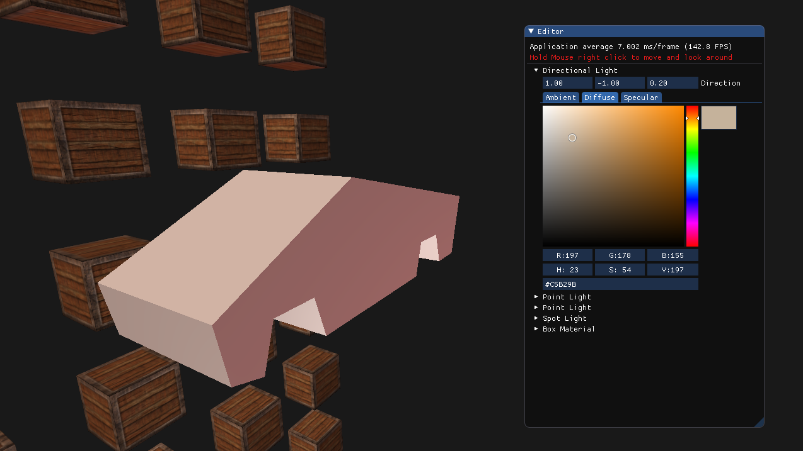
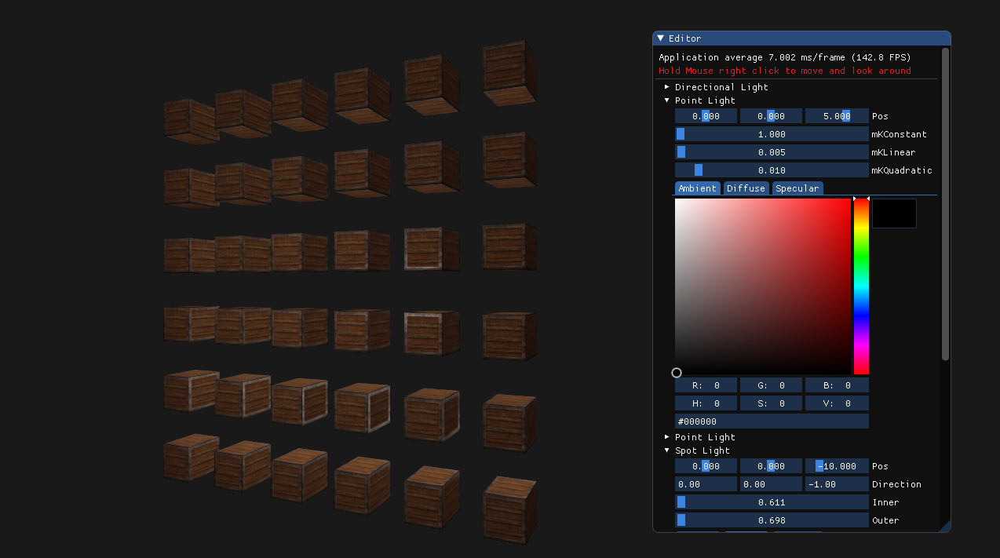

# OpenGL renderer

## Intro

An opengl renderer made for cg self study project. Uses external libs

1. GLFW for windowing
2. glad, opengl loader
3. glm for maths
4. imgui for the editor ui
5. stb_image to load textures

## Building and Running

1. clone/download the repo
2. all dependencies must be included in the repo
3. open and build the vs solution